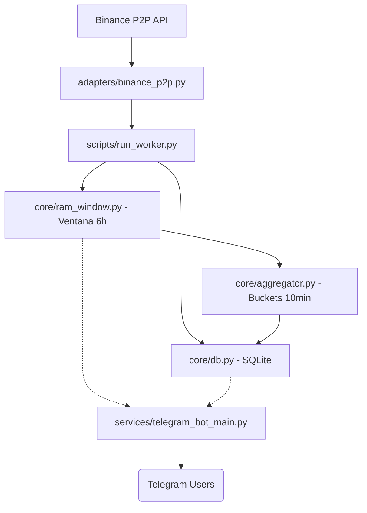

# FastMoney Bot P2P — Telegram Bot de Análisis P2P

Bot de Telegram para el análisis en tiempo real del mercado P2P de Binance, especializado en los pares **USDT-COP** y **USDT-VES**. Utiliza algoritmos de estabilidad (Mediana Profunda) para calcular tasas de cambio, spreads, arbitraje transfronterizo y perfiles de actividad de comerciantes.

## ✨ Características Principales

- **Pipeline Híbrido:** Usa datos de RAM (últimas 6h) para rapidez y SQLite para historial y promedios.
- **Mediana Profunda:** El cálculo de tasas ignora el top 10 volátil y usa las posiciones 40-60 de la lista de anuncios.
- **Arbitraje Real:** Análisis de eficiencia (COP <-> VES) incluyendo comisiones reales de exchange (0.16%).
- **Perfiles de Merchant:** Seguimiento de volumen, confiabilidad y detección de comportamiento automatizado (bots).
- **Gestión Inteligente de Cupos:** Sistema de 30 asientos dinámicos (slots) con rotación automática y lista de espera.
- **Analítica Estratégica (CSO):** Identificación de perfiles (Traders vs Monitores) e índice de gestión de escasez (Hoarding).
- **IA Ready:** Mensajes con metadatos estructurados ocultos para integración fácil con agentes de IA.

## 🚀 Inicio Rápido

### 1. Instalación
```bash
python3 -m venv .venv
source .venv/bin/activate
pip install -r requirements.txt
```

### 2. Configuración
Copia el archivo de ejemplo y edita tus credenciales (`BOT_TOKEN`, `CHAT_ID`, `OWNER_ID`):
```bash
cp .env.example .env
```

### 3. Ejecución Completa
El comando principal inicia tanto el worker de datos (Fetch + RAM) como el bot de Telegram:
```bash
python3 -m scripts.run_bot
```

## 🤖 Comandos Disponibles

### Operaciones y Tasas
- `/tasa` — Tasas oficiales basadas en Mediana Profunda (COP, VES, Zelle-Bs, USD-COP).
- `/cop` — Mercado detallado USDT/COP (Mediana, Spread, Volatilidad).
- `/ves` — Mercado detallado USDT/VES.
- `/arbitraje` — Análisis cruzado de eficiencia entre COP y VES (Incluye 0.16% fee).

### Análisis Avanzado (`/spread` y `/merchant`)
- `/spread` — Resumen de competitividad del mercado.
- `/spread 5` — Spread en una posición específica.
- `/spread 10-20` — Análisis de rango de posiciones.
- `/merchant` — Top comerciantes global.
- `/merchant buy` / `/merchant sell` — Rankings por lado de operación.
- `/merchant @usuario` — Perfil detallado (Volumen 24h/7d, Horarios, Confiabilidad).
- `/merchant search <texto>` — Búsqueda parcial de comerciantes.
- `/merchant estables` / `/merchant rapidos` — Filtros por consistencia o frecuencia.
- `/merchant bots` — Identificación de sospechosos de trading automático.

### Analytics de Volatilidad
- `/volatilidad` — Historial de cambios de precio en las últimas 6 horas con bar charts.

### Administración
- `/auto_on [segundos]` — Activa envíos automáticos de tasas (default 1h).
- `/auto_off` — Desactiva el modo automático.
- `/cso` — **(Admin Only)** Reporte de estrategia semanal con métricas de retención, escasez y viabilidad.
- `/ban <user_id> [razón]` — **(Admin Only)** Bloquea permanentemente a un usuario del sistema.
- `/unban <user_id>` — **(Admin Only)** Remueve a un usuario de la lista negra.
- `/help` — Muestra la ayuda interactiva.

## 👥 Gestión de Usuarios y Límites (Alpha)

Para garantizar la viabilidad técnica y comercial en fase Alpha, el bot cuenta con los siguientes controles:

- **Cuota de Uso:** 15 solicitudes diarias por usuario.
- **Asientos Dinámicos:** Capacidad máxima de 30 usuarios operando simultáneamente. 
- **Rotación Automática:** Cuando un usuario agota sus 15 solicitudes, libera su asiento para el siguiente en la lista de espera.
- **Lista de Espera (Waitlist):** Si los asientos están llenos, el bot te asignará una posición en la cola y te notificará proactivamente cuando un slot se libere.
- **Blacklist:** Sistema de veto selectivo para prevenir el abuso del servicio.

## 🏗️ Arquitectura del Sistema



## 📂 Estructura de Archivos

- `core/` - Motores de procesamiento, DB, scheduler y lógica de negocio.
- `services/` - Handlers de Telegram y módulos de analítica avanzada.
- `adapters/` - Interfaz directa con la API de Binance.
- `scripts/` - Entrypoints para el bot y el worker.

## 🛠️ Notas Metodológicas
- El sistema prioriza la **RAM** para comandos de alta frecuencia y la **DB** como respaldo y para análisis históricos.
- Los metadatos de IA están ocultos tras etiquetas `<tg-spoiler>` para no interferir con la experiencia del usuario humano.

---
*Atte. FastMoney Systems*
