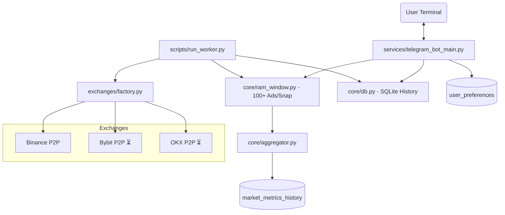

# FastMoney Bot P2P — Terminal de Inteligencia P2P v2.0

Terminal avanzada de análisis en tiempo real para el mercado P2P. Diseñada para traders profesionales y agentes de IA, con soporte multi-exchange y métricas de profundidad de mercado. Especializada en **USDT-COP**, **USDT-VES**, **USDT-ARS** y **USDT-BRL**.

## ✨ Características Principales (v2.0)

- **Arquitectura Multi-Exchange (Factory Pattern):** Soporte nativo para Binance con infraestructura lista para Bybit y OKX.
- **Captura Ultra-Rápida:** Ingesta de 100+ anuncios por lado (200+ por par) cada 60 segundos, optimizada para baja latencia.
- **Mapas de Calor (Heatmaps):** Visualización histórica de spreads en bloques de 1 hora para detectar los mejores momentos de operativa.
- **Análisis de Profundidad (Depth):** Simulación de slippage para órdenes desde $1k hasta $50k y detección de "muros de liquidez".
- **Monitor de Volumen:** Seguimiento de rotación de capital y ratio Compra/Venta para identificar acumulación o liquidación.
- **Pipeline Híbrido:** Datos en tiempo real desde **RAM Window** (últimas 6h) y persistencia histórica en **SQLite**.
- **IA Ready:** Generación automática de metadatos estructurados (JSON) en etiquetas `<tg-spoiler>` para automatización.

## 🤖 Comandos Disponibles

### 🛠️ Configuración y Mercado
- `/config` o `/moneda` — **NUEVO.** Menú interactivo de Selección de Mercado (Binance, Bybit, OKX) y Moneda Base (COP, VES, ARS, BRL).
- `/tasa` — Tasas oficiales basadas en **Mediana Profunda** (ignora volatilidad extrema).
- `/cop` / `/ves` — Resumen rápido del par fiat configurado.
- `/arbitraje` — Análisis de eficiencia cross-border (COP <-> VES) incluyendo comisiones reales.

### 📉 Análisis de Spread
- `/spread` — Promedio de las mejores 5 posiciones.
- `/spread <banco>` — **NUEVO.** Filtrado por método de pago (ej: `/spread banesco`, `/spread bancolombia`).
- `/spread dia` — **NUEVO.** Mapa de calor de las últimas 24 horas en bloques de 1h.
- `/spread semana` — **NUEVO.** Análisis comparativo de spread por día de la semana.
- `/spread N` / `/spread N-M` — Spread en posición exacta o rango de posiciones.
- `/spread >X.X` — Análisis de viabilidad técnica para un umbral de rentabilidad.

### 📊 Liquidez y Profundidad
- `/volume` — **NUEVO.** Análisis de liquidez expuesta y ratio de rotación. Identifica quién domina el mercado.
- `/depth` — **NUEVO.** Análisis de profundidad. ¿Cuánto se mueve el precio si compro/vendo $10,000?

### 👤 Inteligencia de Comerciantes (`/merchant`)
- `/merchant` — Top comerciantes por volumen y confiabilidad.
- `/merchant @usuario` — Perfil forense detallado (Volumen 24h/7d, Horarios, Detección de Bots).
- `/merchant bots` — Identificación de algoritmos de trading automático.

### 📈 Volatilidad y Admin
- `/volatilidad` — Historial de cambios de precio (6h) con interpretación de riesgo.
- `/cso` — **(Admin)** Reporte estratégico de retención de usuarios y gestión de slots.

## 🏗️ Arquitectura del Sistema

## 📂 Organización del Proyecto

- `exchanges/` - Módulos individuales por mercado (Patrón Factory).
- `core/` - Motores de RAM, Base de Datos, Pipeline y Agregador.
- `services/analytics/` - Módulos especializados de análisis (Spread, Volume, Depth, Merchant).
- `services/users/` - Gestión de límites, slots y comportamiento de usuario.
- `adapters/` - Componentes legados de red (en migración a `exchanges/`).

## 🛠️ Notas Metodológicas
- **Lógica de Spread:** Calculado como `((Compra - Venta) / Venta) * 100` desde la perspectiva del merchant.
- **Paginación:** El bot realiza capturas de 100 anuncios por lado (5 páginas de 20 anuncios) para garantizar una muestra estadística válida.
- **Slots Dinámicos:** El sistema gestiona 30 "asientos" de usuarios activos para proteger la integridad del servidor.

---
*Desarrollado por FastMoney Systems — Inteligencia de Mercados P2P.*
