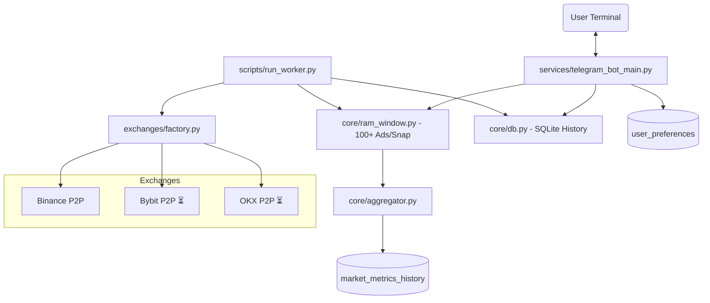

# FastMoney Bot P2P — Terminal de Inteligencia P2P v2.2

Terminal avanzada de análisis en tiempo real para el mercado P2P. Diseñada para traders profesionales y agentes de IA, con soporte multi-exchange y métricas de profundidad de mercado. Especializada en **USDT-COP**, **USDT-VES**, **USDT-ARS** y **USDT-BRL**.

## ✨ Características Principales (v2.2)

- **Arquitectura Multi-Exchange (Factory Pattern):** Soporte nativo para Binance con infraestructura lista para Bybit y OKX.
- **Captura Ultra-Rápida:** Ingesta de 100+ anuncios por lado (200+ por par) cada 60 segundos, optimizada para baja latencia.
- **Merchant Intelligence (v2.1):** Seguimiento persistente por ID único (`userNo`). Cálculo de **Automation Score (0-100)** basado en frecuencia de cambios, persistencia en Top y velocidad de relist.
- **Muros de Liquidez (v2.1):** Identificación automática de soportes y resistencias (walls) en el Top 50 de anuncios.
- **Mapas de Calor (Heatmaps):** Visualización histórica de spreads en bloques de 1 hora convertidos a **zona horaria local**.
- **Análisis de Profundidad (Depth):** Simulación de slippage para órdenes desde $1k hasta $50k filtrado por banco.
- **Monitor de Volumen & Dominancia:** Seguimiento de rotación de capital y **Market Share** por comerciante.
- **Sistema de Automatización (v2.2):** Programación de alertas recurrentes (`/auto`) con persistencia en DB y gestión de niveles de suscripción (SaaS Ready).
- **Inteligencia Estratégica:** Detección de perfiles (Traders vs Monitores) e **Índice de Hoarding** (usuarios que reservan consultas por escasez).
- **Pipeline Híbrido:** Datos en tiempo real desde **RAM Window** (últimas 6h) y persistencia histórica en **SQLite**.

## 🤖 Comandos Disponibles

### 🛠️ Configuración y Mercado
- `/config` — Menú interactivo de Selección de Mercado y Moneda Base (COP, VES, ARS, BRL).
- `/tasa` — Tasas oficiales basadas en **Mediana Profunda**.
- `/ves` / `/cop` — Resumen rápido del par fiat configurado.

### 📉 Análisis de Spread
- `/spread` — Promedio de las mejores 5 posiciones del mercado actual.
- `/spread dia` — Mapa de calor de las últimas 24 horas (bloques de 1h).
- `/spread semana` — Análisis comparativo de spread por día de la semana.
- `/spread <banco>` — Spread filtrado por método de pago (ej: `/spread banesco`, `/spread bancolombia`).
- `/spread >X.X` — Análisis de viabilidad técnica para un umbral de rentabilidad.

### 📊 Liquidez y Profundidad
- `/volume` — Análisis de liquidez expuesta, ratio de rotación y **Dominancia de Merchants**.
- `/depth` — Simulación de slippage por montos ($1k a $50k).
- `/depth muro` — **NUEVO.** Detalle de muros de liquidez (Posición, Volumen, Precio).
- `/depth <banco>` — **NUEVO.** Profundidad y slippage filtrado por banco específico.

### 👤 Inteligencia de Comerciantes (`/merchant`)
- `/merchant @usuario` — Perfil forense con **Automation Score**, ID único de exchange y clasificación (Humano/Bot).
- `/merchant bots` — Ranking histórico de algoritmos detectados por comportamiento anómalo.
- `/merchant grandes` — Identifica a los "Market Makers" (comerciantes ballena).
- `/merchant estables` — Rankings por spread consistente en el tiempo.

### 📈 Volatilidad y Otros
- `/volatilidad` — Historial de cambios de precio (6h) con interpretación de riesgo.

### ⏰ Automatización & Alertas (Premium v2.2)
- `/auto [comando] [opciones] [minutos]` — Programa alertas automáticas periódicas.
  - **Requisito:** Mínimo 30 minutos entre ejecuciones.
  - **Ejemplo:** `/auto spread banesco 60` (Recibirás el spread de Banesco cada hora).
  - **Ejemplo:** `/auto depth 30` (Alerta de profundidad general cada 30 min).
- `/my_autos` — Lista todas tus tareas programadas con su ID único y última ejecución.
- `/stop_auto [ID]` — Detiene permanentemente una automatización (ej: `/stop_auto 12`).

### 👑 Gestión de Usuarios (Admin Only)
- `/cso` — **Dashboard Estratégico.** Resumen de retención, escasez de cupos y diagnóstico de viabilidad comercial del bot.
- `/tier [user_id] [PLAN]` — Cambia el nivel de privilegios y límites de un usuario.
  - `FREE`: 1 Automatización activa.
  - `PRO`: 3 Automatizaciones activas.
  - `WHALE`: 10 Automatizaciones activas.
  - `ADMIN`: 999 Automatizaciones (VIP).
- `/exc [user_id] [dias|admin]` — Crea una excepción VIP temporal o permanente.
  - `/exc 12345 3` (Acceso total por 3 días).
  - `/exc 12345 admin` (Acceso total permanente).
- `/ban` / `/unban` — Gestión de lista negra para prevenir abuso de recursos.

## 🏗️ Arquitectura del Sistema

## 📂 Organización del Proyecto

- `exchanges/` - Módulos individuales por mercado (Patrón Factory).
- `core/` - Motores de RAM, Base de Datos, Pipeline y Agregador.
- `services/analytics/` - Módulos especializados de análisis (Spread, Volume, Depth, Merchant).
- `services/users/` - Gestión de límites, slots y comportamiento de usuario.
- `adapters/` - Componentes legados de red (en migración a `exchanges/`).

## 🛠️ Notas Metodológicas
- **Lógica de Spread:** Calculado professionalmente como `((Venta - Compra) / Compra) * 100` (Markup del Arbitrajista).
- **Paginación:** El bot realiza capturas de 100 anuncios por lado (5 páginas de 20 anuncios) para garantizar una muestra estadística válida.
- **Slots Dinámicos:** El sistema gestiona 30 "asientos" de usuarios activos para proteger la integridad del servidor.
- **Persistencia de Datos:** El sistema mantiene un historial detallado de spreads y métricas por **30 días**, garantizando la continuidad de los reportes `/spread dia/semana` incluso tras reinicios.

---
*Desarrollado por FastMoney Systems — Inteligencia de Mercados P2P.*
